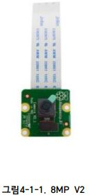
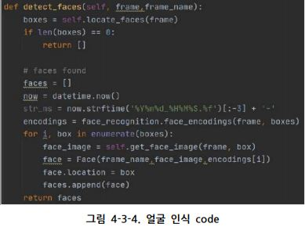

# Capstone_project1
Development of visitor analysis program through image analysis
with VANE company

---

# 1. 과제 수행 배경

1) 미술품 가격을 매기는 부정확한 기준

- 2017년 4월, 국내 한 경매사의 미술품 경매에서 김환기 작가의 '고요(Tranquillity)'라는 작품이 한국 미술품 경매 최고가인 <strong>65억5000만원</strong>에 낙찰됐다.

- 현재 미술품의 가격을 측정하는 데 '<strong>호당가격제</strong>', 보존상태, 작품이력, 희소성 등의 측정기준들이 있다. 하지만, 이 측정 기준들은 수긍할 수 없는 기준이다. 예를 들어, '호당가격제'의 경우 같은 작가의 작품이라도 완성도의 차이가 극명하게 남에도 불구하고 <strong>획일적으로 가격이 매겨지는 경우</strong>가 있다.

- 특히 그림 값의 결정은 한 작가의 작품이라도 할지라도 시대마다 작품마다 <strong>유동적</strong>이다. 결국 미술품 가격은 사는 사람이 마음에 드는 작품을 손안에 넣을 수 있을 때까지 내는 것이 가격이라는 것이 정설이다. 즉 그림의 값은 <strong>구매하는 사람이 결정</strong>한다는 말이다.

2) 미술품의 부정적인 사용

- 미술품은 특히 불법 면세나 돈세탁의 용도로 사용되는 경우가 많음
- 그림1-1의 경우 미술품이 면세임을 이용해 편법적으로 세금을 납부하지 않는 방법으로 미술품을 활용함 

- 그림1-2의 경우, 고가의 미술품을 사들여 되파는 방식으로, 미술품을 돈세탁으로 사용함.
- 미술품의 부정적인 사용으로 인해 <strong>미술품 가격 책정에 합리적인 기준 필요성이 등장</strong>
- 미술품 가격 책정에 합리적인 기준 등장 시 미술품의 부정적인 사용 용도가 제거
- 일반인 또한 미술품의 가격 책정에 참여하여 미술품을 감상하고 소유 할 수 있음
- 고착화된 미술품 시장의 확장과 환기 시도 가능

---

# 2. 과제 목표

1) 미술품의 합리적인 가격 책정 기준 데이터 생성

- 관람객의 반응과 특정 행동을 데이터화 하여 제품의 소요를 구체화
- 면세와 편법 상속 및 돈세탁에 더 이상 미술품을 사용 할 수 없음
- 미술품 시장을 투명하게 관리하여 긍정적인 반응을 이끌어 낼 수 있음

2) 시제품의 소비자 반응을 파악하는데 사용 가능

- 미국의 회사가 좋은 예시 (그림2 미국의 스타트업 참고 ‘b8ta’ )
- 고객들의 반응을 분석하여 제품의 제조사에게 데이터를 제공
- 데이터를 제공받은 제조사는 데이터를 참조하여 시제품 보완 가능

---

# 3. 추진 방법 및 구성도

3-1) 추진 방법

- 스마트 네임택은 작고 관람객에게 방해가 되지 않는 크기의 카메라를 사용

- 구현한 스마트네임택은 프린터로 제작 3d
- 시즌마다 바뀌는 미술관에서 재활용하기 용이함
- 스마트 네임택은 라즈베리파이 카메라 모듈 V4 + 을 사용
- 미술품을 감상하는 미술관 관람객의 정보 나이 성별 등 ( , )을 실시간으로 서버로 전송하여 프로그램을 통해 관람객의 정보를 분석

3-2) 시스템 구성도

## 3-2-1) 전체 구성도

## 3-2-2) 이미지 처리 개요도

- 그림3-4는 관람객의 얼굴 인식을 한 후 관람객의 정보(표정, 연령, 성별)를 추출하기까지의 일련의 과정을 보여줌

---

# 4. 과제 수행 결과

4-1) Raspberry Pi

- <strong>스마트네임택</strong>이라는 환경을 구축하기 위해 여러 가지 사안이 제시되었다.
- 가장 맨 처음 사안으로는 <strong>OpenMV</strong>를 사용하는 카메라 모듈 하나만으로도 얼굴인식이 되는 장치를 사용하기로 하였으나, 장치의 성능이 너무 떨어지고 마이크로파이썬이라는 생소한 프로그래밍 언어로 인해 자체 개발하여 사용하기로 결정하였다.
- 차후 사안으로 스마트네임택을 구현하기 위해 Iot서비스의 대표 주
자인 라즈베리파이에 카메라 모듈을 장착하기로 하였다.
- 라즈베리파이는 원가 절감의 이득을 노리기 위해 라즈베리파이3로 사용하였으나, 일반적인 OpenCV를 사용하는게 아닌 dlib을 통한 얼굴 인식 기능까지 구현해야 하기 때문에 dlib사용시 영상처리 과정에서 약 6초 정도의 딜레이가 발생하여 <strong>라즈베리파이4</strong>로 교체하였다.

- 라즈베리파이에 사용하는 카메라 모듈은 라즈베리파이에서 공식 지원을 해주는 <strong>카메라 모듈 8MP V2</strong>를 사용하였다. 

- 카메라 모듈을 라즈베리파이의 CSI Port에 연결해 사용하고, 라즈베리파이 부팅 후, 아래의 과정에따라 환경 설정 실행을 실행해준다. 

- 라즈베리파이는 기본적으로 Camera 설정이 꺼져 있기 때문에 Enable로 바꾸어 주기 위해 라즈베리파이의 CMD창에서 관리자 권한으로 raspi-config 커맨드를 입력해준다. 

- 그 후 <strong>Camera Tab</strong>으로 이동해 Camera를 Enable로 설정해준다.
- 위의 과정을 통해 라즈베리파이에서 카메라 모듈을 사용할 준비를 마치게 되면, 라즈베리파이에서 성공적으로 카메라모듈을 인식하게 된다. 이후, 라즈베리파이는 파이썬에서 <strong>OpenCV</storng>를 통해 카메라 모듈의 Data Stream을 불러오고 서버와의 통신을 실시한다.

### 사용코드

- 라즈베리파이에서 실행하는 <strong>Client.py</strong>의 사용 라이브러리이다.
- 주된 라이브러리는 OpenCV와 dlib을 사용한다.
- OpenCV를 통해 Camera의 DataStream을 읽어 들어와 영상처리를 가능하게 한다.
- 포트는 10000 port를 사용하여 통신하였다.
- host에 Server에 ip주소를 입력하였다.
- <strong>GetFileSize(Filename) 함수</strong>를 통해 내가 보낼 이미지 File의 Size를 서버로 전송하게 되고, 서버는 File의 Size만큼 Data를 라즈베리파이에서 받아서 이를 모아 이미지로 저장하게 된다.

- cap은 <strong>cv2.VideoCapture(0)</strong>을 통해 라즈베리파이 카메라모듈의 DataStream을 조작할 수 있다.
- 또한 Server와의 Data 통신을 위해 <strong>Socket 통신</strong>을 실시한다.
- Socket의 ip주소와 port를 지정하여 Socket통신을 열어준다. 기본적으로 Client입장에서는 <strong>1:1 connect TCP</strong> 통신으로 연결한다.
- Socket을 통해 Server에 cap에서 불러들여온 DataStream을 전송해준다.

- 라즈베리파이는 작동중, 서버로 <strong>끊임없이</strong> 비디오 화면을 캡쳐해서 보내게된다.
- 일반적으로 비디오 스트림을 계속 보낼 수 있겠지만, dlib을 이용하여 만약 사람의 얼굴이 인식이 될 경우만 이미지를 Server로 보내게되어 불필요한 이미지 생성을 막는다. dlib의 기능 설명은 추후 4-3)Detection에서 진행하도록 하겠다.
- dlib을 통해 얼굴을 인식하게 된다면 사진의 크기를 Server에서 가공하기 위한 크기로 조절해주고, 이를 img 폴더 아래에 순차적으로 저장하게 된다. 이미지 파일은 텍스트 파일에 비해 크기가 큰 편이기 때문에 Server에서 성공적으로 받기 위해선 먼저 file의 크기를 얻어오고, file의 크기를 Server로 보내고 난 뒤, Server에서 file의 크기만큼 받아오게 한다.

4-2) Server

- Server는 자신의 ip주소로 연결을 요청하는 Client를 연결해서 Data만 받아주면 되기 때문에 따로 OpenCV를 사용하지 않는다.
- User_list를 통해 Client들의 Socket을 관리한다. 

- Server는 기본적으로 다수의 Client에게 Data를 받아야 하기 때문에 thread로 Client를 관리하게 해준다. 

- Client의 연결이 요청되면 handle_receive함수를 통해 연결을 진행하고 Client별로 폴더를 만들어 그 폴더 안에 이미지 파일로 저장하게 된다.
- Client에게 File의 크기를 먼저 받게 되고, 그 File의 크기만큼 Data를 전달 받게 되면 Data를 jpg형식으로 Client 폴더안에 저장하게 된다.

4-3) Detection

### Face Detection

- <strong>dlib</strong> 라이브러리는 C++로 작성된 toolkit이지만, python 패키지로도 설치해 사용할 수 있다. 특히 <strong>HOG(Histogram of Oriented Gradients)</strong>을 사용하여 얼굴 검출하는 기능이 많이 사용되고 있다.
- <strong>HOG</strong>는 픽셀 값의 변화로 파악할 수 있는 <strong>영상의 밝기가 변하는 방향</strong>을 <strong>그레디언트(gradient)</strong>로 표현하고, 이로부터 <strong>객체의 형태></strong>를 찾아 낼 수 있다.
- dlib은 사람의 얼굴에 <strong>68개</strong>의 점(특징점)을 찍고, 점을 기반으로 추출하여 점의 위치를 128개의 벡터화(이는 deep learning의 결과물)를 통하여 저장할 수 있다. 만약 같은 사람의 얼굴이 입력 값으로 주어진다면, 128개의 벡터가 비슷한 숫자가 나온다. 즉, 나온 숫자를 바탕으로 유사성을 구할 수 있으며, 이를 활용하여, <strong>사람 인식(Recognition)</strong>에도 활용하였다.
- 이러한 과정을 구현하기 위해, dlib 패키지의 <strong>face_locations()</strong> 함수를 활용하여 <strong>68개의 점</strong>을 추출한다. 또한, <strong> face_encodings()</strong> 함수는 dlib와 numpy에 쉽게 접근할 수 있도록 wrapping해주는데, 이 함수의 결과물로써 <strong>128개의 벡터값</strong>들이 제공된다.
- <strong>사람의 얼굴을 구분</strong>하기 위해서는 128개의 벡터값들을 서로 비교하여 같은 사람인지 다른 사람인지를 판단해야한다. 이러한 벡터 값들의 유사도를 비교하기 위해서 <strong>Euclidean distance(유클리드 거리)</strong>를 이용하여 두 벡터간의 거리를 구하였다. 이러한 기능은 face_recognitinon의 <strong>face_distance()</strong> 함수가 지원을 해준다. 구해진 거리의 결과 값은 0~1사이 값으로 나온다. 구해진 거리의 결과 값을 통해 기존에 저장되어 있던 벡터들과 새로운 입력 값의 벡터를 비교하여 만약, 가장 높은 숫자를 보유하면서 <strong>Similarity Threshold(유사 임계값)</strong>보다 낮다면 같은 얼굴로 판단하며, Similarity Threshold보다 높다면 다른 얼굴, 즉, 기존의 사람이 아닌 새로운 사람이라고 판단한다.
- 보통 서양인의 얼굴에서는 Similarity Threshold의 수치는 0.4~0.45가 적당하다고 알려져있으며, 프로젝트에서는 동양인 위주 얼굴인점과 라즈베리파이의 카메라 화질을 고려하여 Similarity Threshold의 수치를 <strong>0.35로 설정</strong>하였다. 이때, 카메라 화질을 고려하는 이유는, face_encodings()을 통해 구해진 벡터들은 얼굴의 표정, 각도, 이미지 크기, 조명 상태 등 여러 변수에 의해 달라지기 때문에, Euclidean distance로 구한 값이 낮아질 수 있기 때문이다.
- 현재 얼굴 탐색에서 가장 많이 활용되고 있지만, 이외에도 보행자 검출 등에 활용할 수 있다.

### 사용코드

- 기능을 구현하기 위해, <strong>face_classifier.py</strong>와 <strong>person_db.py</strong>를 구현했다.
- <strong>그림 4-3-2</strong>는 각 작품마다 찍힌 frame을 분석하기 위해 작품 별로 <strong>경로를 설정</strong>하는 과정이다.

- <strong>그림 4-3-3</strong>은 person_db.py를 통해 기존에 분석한 사람의 얼굴을 <strong>face_encodings()</strong>을 통해 <strong>벡터화 한 값을 파일로 저장</strong>하였으며, <strong>pdb.load_db(result_dir)</strong>를 통해 <strong>기존에 저장된 벡터를 불러온다</strong>. 이를 바탕으로, 새로운 입력 값과 비교할 준비를 한다.
- 라즈베리파이로부터 받은 <strong>이미지에서 얼굴 인식하는 방법</strong>으로 face_recognition의 <strong>face_encodings를 통해 인식</strong>을 하며, 해당 값을 <strong>face list</strong>에 저장한다. 이때, <strong>인식된 얼굴이 여러개</strong>일 경우 <strong>faces list에 여러개의 값이 저장</strong>된다. 그 후 faces list를 반환한다.

- <strong>그림 4-3-4</strong>의 <strong>compare_with_known_persons()</strong>를 통해 <strong>새롭게 얼굴이 인식</strong>되면, <strong>기존</strong>에 알고 있던 사람들의 <strong>정보의 face_encodings()과 유클리드 거리를 사용</strong>하여 값을 구한다. 이때, 가장 거리가 가까운 사람의 거리가 <strong>similairty_threshold보다 작으면 같은 얼굴</strong>이라고 판단하고, person_DB에 얼굴을 추가한다. 그 후 새로 추가된 얼굴을 포함하여 face_encodings()을 업데이트한다.
- <strong>그림 4-3-5</strong>를 통해 <strong>compare_with_unknown_faces()</strong>를 통해 <strong>모르는 얼굴은 unknown_faces</strong>에 따로 저장해 놓는다. <strong>새로 인식된 얼굴과 unknown_faces과의 유클리드 거리</strong>를 구한다. 이때, 가장 가까운 얼굴과의 distance가 <strong>similarity_threshold 보다 작다면 두 얼굴은 같은 사람의 얼굴</strong>이라고 판단하고, <strong>새로운 사람</strong>을 만든다. 하지만, distance가 <strong>similarity_threshold 보다 크다면 unknown_faces</strong>에 추가한다.

---