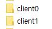
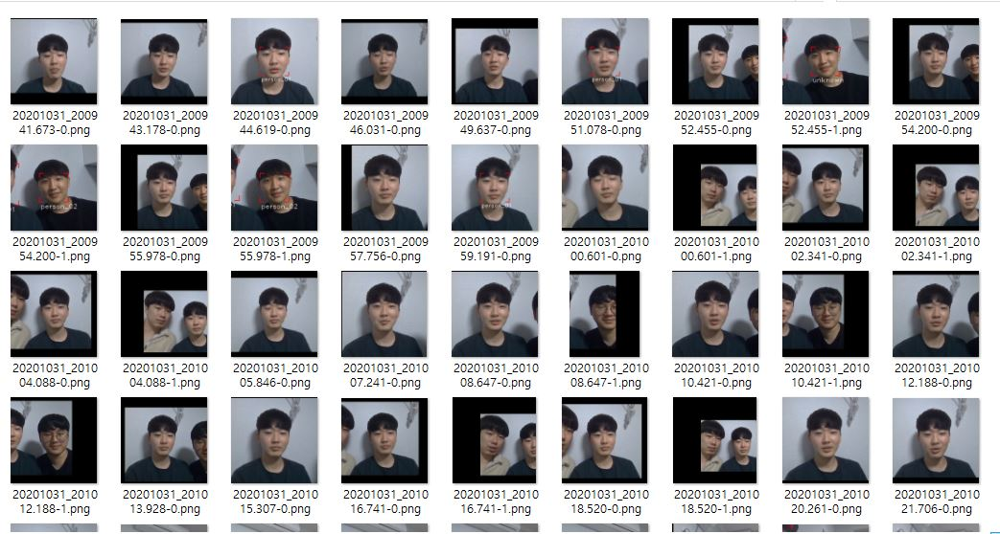
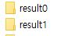
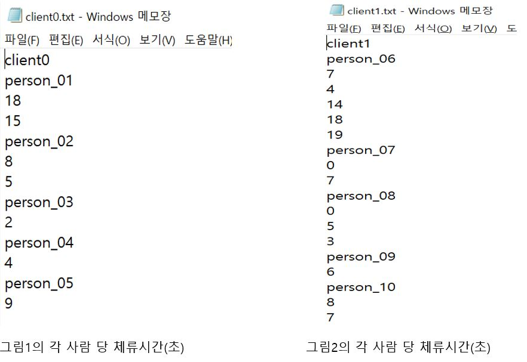

# 모르는 얼굴 구분하기_Unknown Face Classifier & 체류 시간 구하기_stay time

# 목적

* 라즈베리파이에서 얼굴인식으로 받아온 이미지들을 바탕으로 시간 순으로 사람의 얼굴을 분석하여 구별된 개개인의 폴더안에 사진들을 분류하여 저장하고 각각의 사람들의 해당 라즈베리파이(작품) 앞에서의 체류시간을 구한다.
  
---

# 로직

* faces들을 encoding하여 저장한 뒤 다음 사진을 분석할 때 encoding을 불러와 비교한다.
* 만약, 그 encoding이 어떤 person이랑 비슷하다면, 해당 person에 얼굴을 저장한다.
* 만약, 그 encoding이 unknowns faces 중 어느 face랑 비슷하다면, new person을 만든다. 그렇지않다면, unknowns faces에 얼굴을 저장한다.
* 위 과정을 라즈베리파이한테 받은 이미지 전부를 처리했다면, 각각의 분류된 사람들을 폴더가 만들어져있고 그 안에는 해당 사람의 이미지가 있을 것이다.
* 개개인이 분류된 폴더를 통해, 각 이미지 파일들이 생성된 시간을 가져와(ctime) 정렬한다.
* 정렬한 이미지들을 바탕으로, 만약 N번째 이미지와 N+1번째 이미지가 자신이 제한한 시간(초) 이내의 시간차가 나지 않을 경우, N+1번째 이미지와 N+2번째 이미지를 비교한다.
* 만약 N번째 이미지와 N+1번째 이미지가 자신이 제한한 시간(초) 이내의 시간차가 나는 경우, 이는 라즈베리파이(작품) 앞에서 해당 사람이 떠났다가 다시 나타난 것으로 판단하여 체류시간으로 기록한다.


---

# 결과

각각의 라즈베리파이(작품)로부터 받은 이미지들은 client0,client1,...에 저장되어 있다.
* 
* 예시>client0 폴더 안 이미지 파일들
  * 

분류된 결과는 `result`+`숫자` 로 된 디렉터리 안에 저장되어있다.(이때, 숫자는 각 라즈베리파이의 고유 번호를 의미함.) 이러한 결과는 다음 실행때 계속 불러온다.

* 
   
   result0 디렉터리 안 모습
* `person_##` 디렉터리에서 분류된 faces들을 확인한다.
* 잘못 분류된 faces들은 다음 실행에서의 정확도를 높이기 위하여 `unknowns` 디렉터리로 옮긴다.

다음날 새롭게 시작할려면 `result` 디렉터리를 제거하면 처음부터 faces 얼굴 데이터를 모을 수 있다.


각각의 라즈베리파이(작품)에서의 개개인의 체류시간을 구한 모습이다.
* 

---

# 코드설명

```python
# load person DB
result_dir = "result" + str(q)
pdb = PersonDB()
pdb.load_db(result_dir)
pdb.print_persons()
```
   * 여기서 str(q)는 라즈베리파이(작품) 번호이다.
   * PersonDB()는 person_db.py에 있는 class인 PersonDB이다.
   * q번 라즈베리파이에서의 분류된 이미지들이 모여있는 result##으로부터 미리 encoding해둔 데이터를 읽어온다.

```python
fc = FaceClassifier(0.35, 1.0)
```

<details>
<summary>Class FaceClassifier() code</summary>

```python
class FaceClassifier():
    def __init__(self, threshold, ratio):
        self.similarity_threshold = threshold
        self.ratio = ratio

def get_face_image(self, frame, box):
        img_height, img_width = frame.shape[:2]
        (box_top, box_right, box_bottom, box_left) = box
        box_width = box_right - box_left
        box_height = box_bottom - box_top
        crop_top = max(box_top - box_height, 0)
        pad_top = -min(box_top - box_height, 0)
        crop_bottom = min(box_bottom + box_height, img_height - 1)
        pad_bottom = max(box_bottom + box_height - img_height, 0)
        crop_left = max(box_left - box_width, 0)
        pad_left = -min(box_left - box_width, 0)
        crop_right = min(box_right + box_width, img_width - 1)
        pad_right = max(box_right + box_width - img_width, 0)
        face_image = frame[crop_top:crop_bottom, crop_left:crop_right]
        if (pad_top == 0 and pad_bottom == 0):
            if (pad_left == 0 and pad_right == 0):
                return face_image
        padded = cv2.copyMakeBorder(face_image, pad_top, pad_bottom,
                                    pad_left, pad_right, cv2.BORDER_CONSTANT)
        return padded

   def detect_faces(self, frame,frame_name):
   boxes = self.locate_faces(frame)
   if len(boxes) == 0:
      return []

   # faces found
   faces = []
   now = datetime.now()
   str_ms = now.strftime('%Y%m%d_%H%M%S.%f')[:-3] + '-'
   encodings = face_recognition.face_encodings(frame, boxes)
   for i, box in enumerate(boxes):
      face_image = self.get_face_image(frame, box)
      #face = Face(str_ms + str(i) + ".png", face_image, encodings[i])
      #face = Face(frame_name + ".png",face_image,encodings[i])
      #mtime = time.ctime(os.path.getmtime(pathname))
      face = Face(frame_name,face_image,encodings[i])
      face.location = box
      faces.append(face)
   return faces

   def compare_with_known_persons(self, face, persons):
      if len(persons) == 0:
         return None

      # see if the face is a match for the faces of known person
      encodings = [person.encoding for person in persons]
      distances = face_recognition.face_distance(encodings, face.encoding)
      index = np.argmin(distances)
      min_value = distances[index]
      if min_value < self.similarity_threshold:
         # face of known person
         persons[index].add_face(face)
         # re-calculate encoding
         persons[index].calculate_average_encoding()
         face.name = persons[index].name
         return persons[index]

   def compare_with_unknown_faces(self, face, unknown_faces):
      if len(unknown_faces) == 0:
         # this is the first face
         unknown_faces.append(face)
         face.name = "unknown"
         return

      encodings = [face.encoding for face in unknown_faces]
      distances = face_recognition.face_distance(encodings, face.encoding)
      index = np.argmin(distances)
      min_value = distances[index]
      if min_value < self.similarity_threshold:
         # two faces are similar - create new person with two faces
         person = Person()
         newly_known_face = unknown_faces.pop(index)
         person.add_face(newly_known_face)
         person.add_face(face)
         person.calculate_average_encoding()
         face.name = person.name
         newly_known_face.name = person.name
         return person
      else:
         # unknown face
         unknown_faces.append(face)
         face.name = "unknown"
         return None
        
```

* def __init__(self, threshold, ratio)
  * threshold(기존 얼굴들과의 정확도 정도로 보면 된다)와 이미지 비율 조정인 ratio를 받아온다.
* def detect_faces(self, frame,frame_name)
  * 
* def compare_with_known_persons(self, face, persons)
* def compare_with_unknown_faces(self, face, unknown_faces)

</details>

참고 : [https://ukayzm.github.io/unknown-face-classifier/](https://ukayzm.github.io/unknown-face-classifier/)